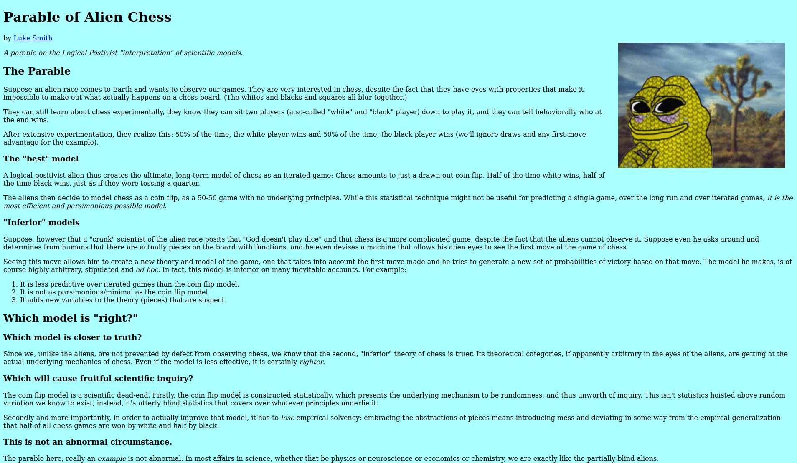
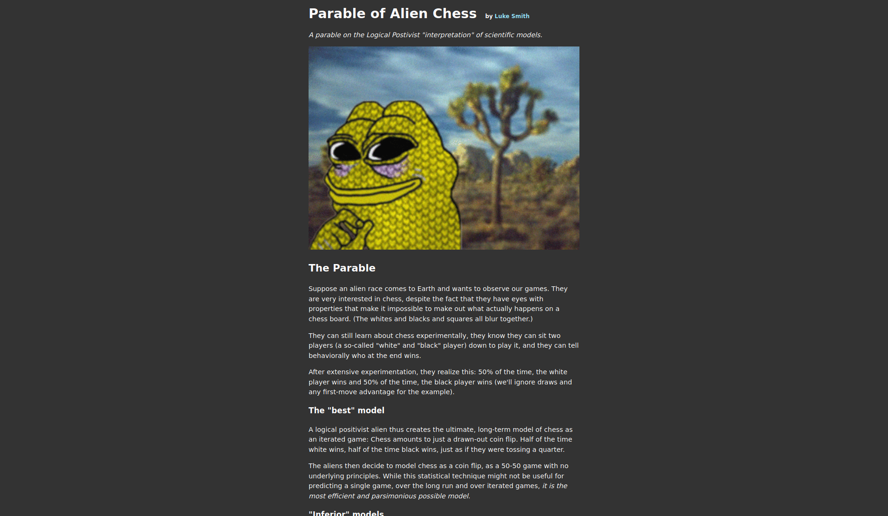

# Fixing Luke Smith's new design

## Before ([link](https://lukesmith.xyz/articles/chess)) 

## After ([link](https://kolaczyn.github.io/luke-smith-article))

## Why did I do it?
I don't mind Luke Smith's philosophy. But if Luke want people to read his stuff, he needs to do something about his website.  It's very hard to read the text in his articles.  
I undestand that Luke wants to keep everything minimal, but this is just going too far. You don't to add that much CSS to make visiting [Luke's website](https://lukesmith.xyz) much more enjoyable.

## What I've changed
- text occupies about 30% of the screen, so your eyes don't have to jump all over the place while reading,
- increased spacing between lines, making the text less crammed,
- changes font to sans serif. I personally don't like the default serif font, and using one of Google Fonts is, well, probably out of the question,
- dark theme,
- images are not just floating to the right, they now in more logical places
- I've added roughly 20 lines CSS and slighly changed HTML
